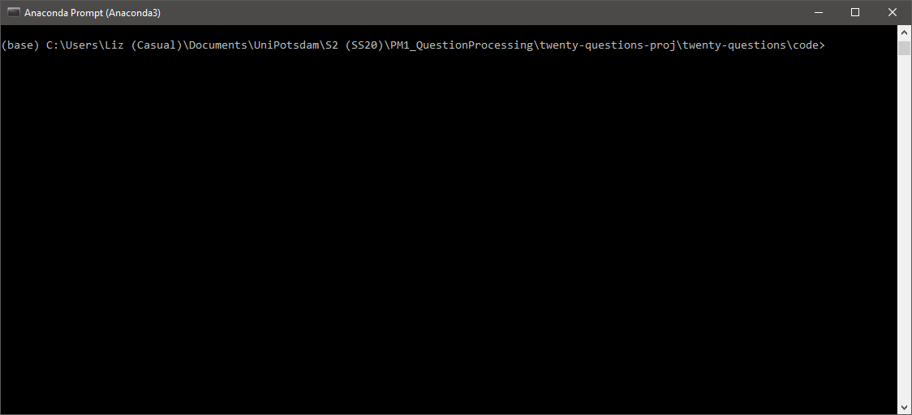

# 20 Questions

A program that plays 20 Questions.

Term project for the course **PM1 Question Processing** at the Universität Potsdam in the summer semester 2020, taught by Dr. Tatjana Scheffler.

Developed by **Wellesley Boboc, Anna-Janina Goecke, Rodrigo Lopez Portillo Alcocer,** and **Elizabeth Pankratz.**

## What it does 

You think of an animal, and our 20 Questions player will try to guess which animal you're thinking of.
If the animal you chose isn't in its knowledge base, the system will add it in using the information you've provided, and it will automatically fill in all the blanks that remain. 



## Setup

To run this script, you need Python 3 and the libraries `en_core_web_sm`, `lemminflect`, `numpy`, `os`, `pandas`, and `spacy`.

To install `en_core_web_sm` in Anaconda, execute the following (more info on [anaconda.org](https://anaconda.org/conda-forge/spacy-model-en_core_web_sm)):

```
conda install -c conda-forge spacy-model-en_core_web_sm
```

## How to play

Begin by cloning this repository.

```
git clone https://github.com/epankratz/twenty-questions
```

Now, navigate into the directory `twenty-questions/code/`.
To play on the command line, start up your interactive Python shell, and then execute the following commands.

```
>>> import TwentyQuestions as TQ
>>> TQ.game.play()
```

To play more than once, you can re-run `TQ.game.play()` as many times as you'd like.

(Importing the module will take a few seconds while all the libraries are loaded, but then the fun can begin!)

## Looking a bit deeper

If you want to look more closely at the class and its methods, see `code/20q-playground.ipynb`.
That notebook already contains some examples showcasing the question generation method for various features (and you can even add in your own feature and see what happens!).
